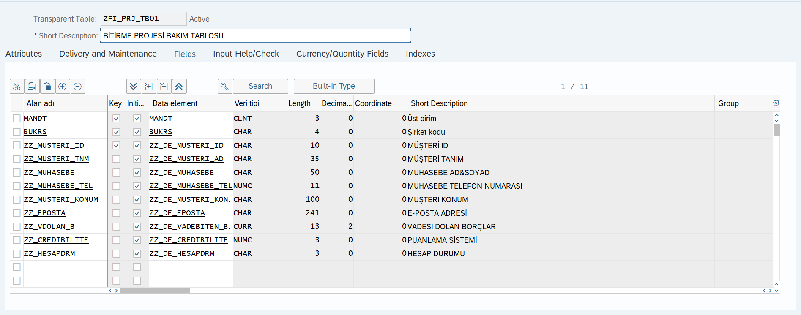

### Selamlar
 Bu program kodlarında,**SAP ABAP** üzerinde üretim yapan bir markanın,toptan satış yaptığı firmalara geriye dönük ödemeler(vade) noktasında verilen kurallar ile birlikte firmaların risk durumu tespiti yapacağız.Sonrasında yüksek riskden düşüğe  doğru **ALV'de**  raporlamasını yapacağız.


- Öncelikle [`ZFI_PRJ_TB01`](https://github.com/frkylmz5234/SAP-ABAP/blob/main/ZFI_PRJ_TB01.png) bakım tablomuzun fiziksel veri tabanının içinde nesnelerimiz tanımlandı.
- İkinci adımda ise [`ZFI_PRJ_TB02`](https://github.com/frkylmz5234/SAP-ABAP/blob/main/ZFI_PRJ_TB02.png) kurallar tablomuzu oluşturduk.
- Üçüncü tablomuz olan [`ZFI_PRJ_TB03`](https://github.com/frkylmz5234/SAP-ABAP/blob/main/ZFI_PRJ_TB03.png)'de muhasebeci bilgilerinin bulunacağı veri tabanını oluşturduk.
- Sonrasında ise `SM30`'da [`Muhasebeci Tablosu`](https://github.com/frkylmz5234/SAP-ABAP/blob/main/ZFI_PRJ_TB03.XLSX) ve [`Kurallar Tablosu`](https://github.com/frkylmz5234/SAP-ABAP/blob/main/ZFI_PRJ_TB02.XLSX) 'nu veriler ile doldurma işlemi gerçekleştirildi.


**Kurallar Tablosu'nun** içinde firmaların hangi şartlar üzerinden değerlendirileceği,açıklaması ve ceza puanı verileri `SM30`'da girilmiştir.

**Muhasebeci Tablosun'da** her firmanın kendine ait  iletişim ile ilgili verileri `SM30`'da girilmiştir.
 
Tabloların oluşumu ve içine veri girme işlemleri bittikten sonra `SE38`'de koz yazımına geçildi.

- İlk olarak `SE38`'de [`ZFI_PRJ_COD01`](https://github.com/frkylmz5234/SAP-ABAP/blob/main/ZFI_PRJ_COD01)'de oluşturulan veriler ve tablolar arasında gerekli işlemlerin yazıldığı kod kısmıdır.


```

DATA: lv_vade LIKE sy-datum.
  DATA: lv_tarih LIKE sy-datum.
  DATA: lv_oncekigun LIKE sy-datum.
  DATA: lv_onbesgun LIKE sy-datum.
  DATA: lv_otuzgun LIKE sy-datum.
  DATA: lv_altmisbirgun LIKE sy-datum.

  lv_oncekigun = p_budat - 1.
  lv_onbesgun = p_budat - 15.
  lv_otuzgun = p_budat - 30.
  lv_altmisbirgun = p_budat - 61.


  SELECT kunnr dmbtr bukrs zfbdt zbd1t zbd2t budat
    FROM bsid
    INTO TABLE gt_bsid
    WHERE bukrs IN s_bukrs
    AND  budat IN s_budat.


  LOOP AT gt_bsid INTO gs_bsid.
    MOVE-CORRESPONDING gs_bsid TO gs_vade.
    lv_vade = gs_vade-budat +  gs_vade-zbd1t + gs_vade-zbd2t .
    IF lv_vade LT sy-datum.
      gs_vade-vade = 'X'.

    ENDIF.


    IF gs_vade-vade = 'X' .
      MOVE-CORRESPONDING gs_vade TO gs_collect.
      IF lv_oncekigun EQ lv_vade.
        gs_collect-gun_dmbtr = gs_vade-dmbtr.

      ENDIF.
      IF lv_onbesgun LE lv_vade.
        gs_collect-onbes_dmbtr = gs_vade-dmbtr.

      ENDIF.
      IF lv_otuzgun LE lv_vade.
        gs_collect-otuz_dmbtr = gs_vade-dmbtr.

      ENDIF.
      IF lv_altmisbirgun LE lv_vade.
        gs_collect-altmisbir_dmbtr = gs_vade-dmbtr.

      ENDIF.


      COLLECT gs_collect INTO gt_collect.

    ENDIF.

    CLEAR: gs_collect,
           gs_vade,
           gs_bsid,
           lv_tarih.

  ENDLOOP.
```



