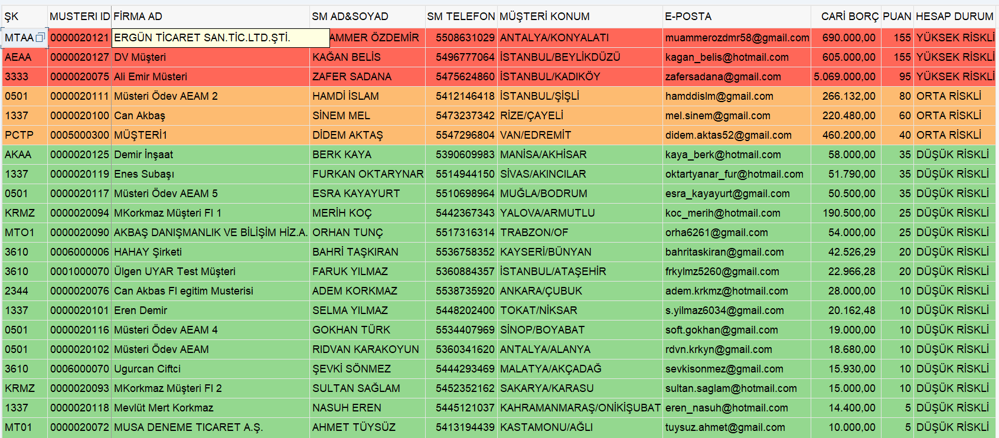

### Selamlar
 Bu program kodlarında,**SAP ABAP** üzerinde üretim yapan bir markanın,toptan satış yaptığı firmalara geriye dönük ödemeler(vade) noktasında verilen kurallar ile birlikte firmaların risk durumu tespiti yapacağız.Sonrasında yüksek riskden düşüğe  doğru **ALV'de**  raporlamasını yapacağız.Öncelikle `SE11`,`SE38`,`SM30 `ve `Reuse-ALV`'lerin neler olduğunu hatırlayalım.

- **SE11 (Data Dictionary):** Veri modellerini oluşturmak ve yönetmek için kullanılan bir araçtır. 
- **SE38 (ABAP Editor):** ABAP kodu yazmak, düzenlemek ve test etmek için kullanılan bir araçtır.
- **SM30 (Table Maintenance Generator):** Bu araç, veri tablolarının veri girişine ve bakımına yönelik ekranları oluşturmak için kullanılır.
- **Reuse-ALV :** SAP sistemi için önceden tanımlanmış bir ALV sınıfıdır ve ALV tablolarını oluşturma ve yönetme sürecini kolaylaştırır.


- İlk olarak [`ZFI_PRJ_TB01`](https://github.com/frkylmz5234/SAP-ABAP/blob/main/ZFI_PRJ_TB01.png) bakım tablomuzun fiziksel veri tabanının içinde nesnelerimiz tanımlandı.
- İkinci adımda ise [`ZFI_PRJ_TB02`](https://github.com/frkylmz5234/SAP-ABAP/blob/main/ZFI_PRJ_TB02.png) kurallar tablomuzu oluşturduk.
- Üçüncü tablomuz olan [`ZFI_PRJ_TB03`](https://github.com/frkylmz5234/SAP-ABAP/blob/main/ZFI_PRJ_TB03.png)'de muhasebeci bilgilerinin bulunacağı veri tabanını oluşturduk.
- Sonrasında ise `SM30`'da [`Muhasebeci Tablosu`](https://github.com/frkylmz5234/SAP-ABAP/blob/main/ZFI_PRJ_TB03.XLSX) ve [`Kurallar Tablosu`](https://github.com/frkylmz5234/SAP-ABAP/blob/main/ZFI_PRJ_TB02.XLSX) 'nu veriler ile doldurma işlemi gerçekleştirildi.


**Kurallar Tablosu'nun** içinde firmaların hangi şartlar üzerinden değerlendirileceği,açıklaması ve ceza puanı verileri `SM30`'da girilmiştir.

**Muhasebeci Tablosun'da** her firmanın kendine ait  iletişim ile ilgili verileri `SM30`'da girilmiştir.
 
Tabloların oluşumu ve içine veri girme işlemleri bittikten sonra `SE38`'de koz yazımına geçildi.

- İlk olarak `SE38`'de [`ZFI_PRJ_COD01`](https://github.com/frkylmz5234/SAP-ABAP/blob/main/ZFI_PRJ_COD01)'de oluşturulan veriler ve tablolar arasında gerekli işlemlerin yazıldığı kod kısmıdır.

### VADE HESAPLAMA
```
DATA: lv_vade LIKE sy-datum.
  DATA: lv_tarih LIKE sy-datum.
  DATA: lv_oncekigun LIKE sy-datum.
  DATA: lv_onbesgun LIKE sy-datum.
  DATA: lv_otuzgun LIKE sy-datum.
  DATA: lv_altmisbirgun LIKE sy-datum.

  lv_oncekigun = p_budat - 1.
  lv_onbesgun = p_budat - 15.
  lv_otuzgun = p_budat - 30.
  lv_altmisbirgun = p_budat - 61.


  SELECT kunnr dmbtr bukrs zfbdt zbd1t zbd2t budat
    FROM bsid
    INTO TABLE gt_bsid
    WHERE bukrs IN s_bukrs
    AND  budat IN s_budat.


  LOOP AT gt_bsid INTO gs_bsid.
    MOVE-CORRESPONDING gs_bsid TO gs_vade.
    lv_vade = gs_vade-budat +  gs_vade-zbd1t + gs_vade-zbd2t .
    IF lv_vade LT sy-datum.
      gs_vade-vade = 'X'.

    ENDIF.
```

İlk önce bazı veri türlerinde değişkenler tanımlanır. Ardından, **bsid** tablosundan` s_bukrs` ve `s_budat` aralığında veriler seçilir ve `gt_bsid` tablosuna atılır.Daha sonra `gt_bsid` tablosundaki her bir kayıt için, birkaç değişkene veriler atanır ve bir koşul kontrol edilir.


```
IF gs_vade-vade = 'X' .
      MOVE-CORRESPONDING gs_vade TO gs_collect.
      IF lv_oncekigun EQ lv_vade.
        gs_collect-gun_dmbtr = gs_vade-dmbtr.

      ENDIF.
      IF lv_onbesgun LE lv_vade.
        gs_collect-onbes_dmbtr = gs_vade-dmbtr.

      ENDIF.
      IF lv_otuzgun LE lv_vade.
        gs_collect-otuz_dmbtr = gs_vade-dmbtr.

      ENDIF.
      IF lv_altmisbirgun LE lv_vade.
        gs_collect-altmisbir_dmbtr = gs_vade-dmbtr.

      ENDIF.


      COLLECT gs_collect INTO gt_collect.

    ENDIF.

    CLEAR: gs_collect,
           gs_vade,
           gs_bsid,
           lv_tarih.

  ENDLOOP.
```
Eğer `lv_vade` adlı değişken, şimdiki tarihten küçükse (geçmiş bir tarihse), o zaman `gs_vade` adlı yapıda yer alan vade alanına "X" ataması yapılır.
Eğer vade alanı "X" olarak işaretlenmişse, bu kayıt için belirli bir koşul sağlanmış demektir. Bu durumda, bu kaydın bazı bilgileri, `gs_collect` adlı yapıya aktarılır.
Daha sonra, `gs_collect` adlı yapı, belirli tarih aralıklarına göre ayrılır ve her aralık için, o aralıktaki toplam **dmbtr** (Alacak/Borç Tutarı) hesaplanır ve ilgili değişkene atanır.
Son olarak, hesaplanan bilgiler, `gt_collect` adlı tabloya eklenir.


**CREDIBILITE**

```
 READ TABLE gt_tbl02 INTO gs_tbl02 WITH KEY zz_cre_kural = 'ZCR0001'.
    IF sy-subrc EQ 0.
      IF gs_collect-gun_dmbtr GT gs_tbl02-zz_cre_tutar1.
        gs_tbl01-zz_credibilite = gs_tbl01-zz_credibilite + gs_tbl02-zz_cre_puan.

      ENDIF.


    ENDIF.
```

Bu kod, `gt_tbl02"` tablosundan belirli bir kurala sahip satırları okur ve belirli bir koşulu karşıladıklarında, `gs_tbl01-zz_credibilite` değişkenine ek bir puan ekler.Böyle toplam 10 kural mevcuttur.


- Son olarak **SE38**'de [`ZFI_PRJ_COD02`](https://github.com/frkylmz5234/SAP-ABAP/blob/main/ZFI_PRJ_COD02)'de **ALV** raporlama işlemi yapılacaktır.

- **Structure**, bir ALV tablosundaki her bir sütunun veri yapısını ve diğer özelliklerini belirleyen bir yapıdır.Her bir sütun, Structure içinde bir alan olarak tanımlanır ve daha sonra ALV tablosuna eklenir.
- ALV içinde ilk olarak [`ZFI_PRJ_ALV01 STRUCTURE`](https://github.com/frkylmz5234/SAP-ABAP/blob/main/ZFI_PRJ_ALV01%20STRUCTURE.png) tanımlaması yapıldı.

### Giriş Parametresi

```
SELECTION-SCREEN BEGIN OF BLOCK al WITH FRAME TITLE TEXT-001.
  PARAMETERS: p_budat TYPE bsid-budat OBLIGATORY.
SELECTION-SCREEN END OF BLOCK al.
```

Bu kod, programın kullanıcı tarafından belirlenen bir tarih değerine göre çalışmasını sağlar ve kullanıcının bu tarihi girmesi için bir seçim ekranı oluşturur.Ayrıca, "**OBLIGATORY**" özelliği belirtilerek, kullanıcının bu parametreyi girme zorunluluğu getirilir.


- **'DD_DOMVALUES_GET'** fonksiyonu ile bir **ALV** raporundaki hesaplar bölümünü görselleştirmek için kullanılabilir.Aşşağıda ki kodda `gt_hesapdrm` değişkeninde ki sayısal değerlerin tanımı `hesapdrm_tnm` adlı değişkene atanarak kullanılmıştır.

```
 CALL FUNCTION 'DD_DOMVALUES_GET'
    EXPORTING
      domname              = 'ZZ_DO_HESAPDRM'
     TEXT                 = 'X'
     LANGU                = sy-langu

    tables
      dd07v_tab            = gt_hesapdrm
   EXCEPTIONS
     WRONG_TEXTFLAG       = 1
     OTHERS               = 2
            .
 LOOP AT gt_alv01 INTO gs_alv01.
      READ TABLE gt_hesapdrm
       INTO gs_hesapdrm
        WITH KEY domvalue_l = gs_alv01-zz_hesapdrm.
          gs_alv01-hesapdrm_tnm = gs_hesapdrm-ddtext.
```


### OUTPUT
 Veriler gerçek veri değildir!!!
- Son olarakda yazılan kodun çıktısı olan,firmaların yüksek riskten düşük riske doğru sıralanmış ALV gösterimi:



